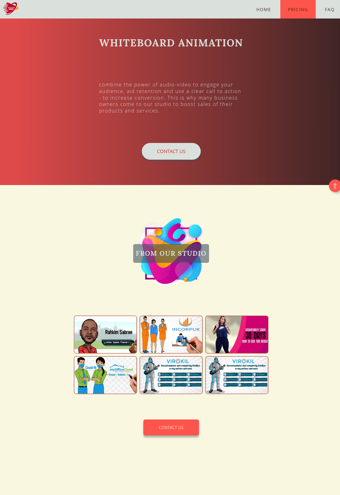
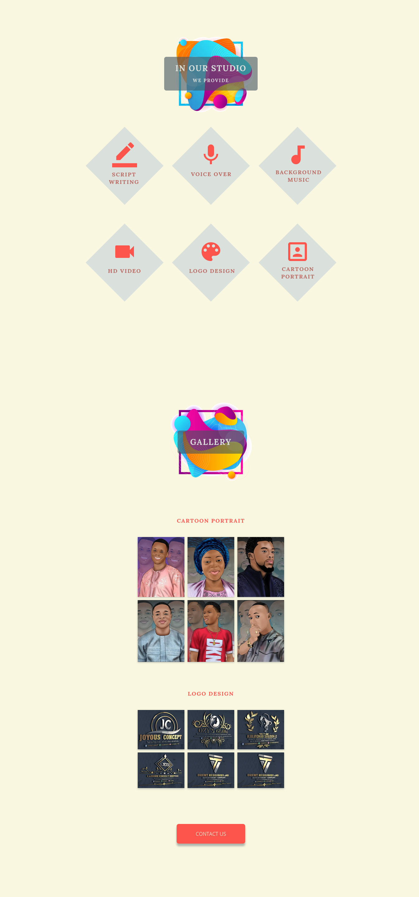
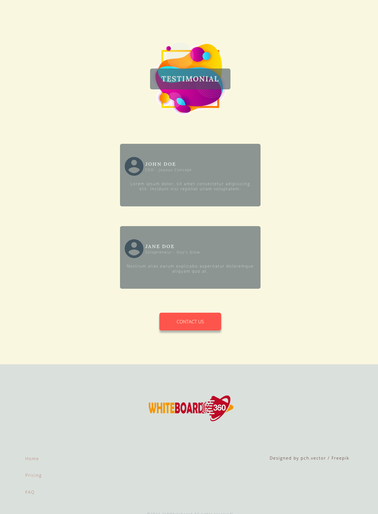

# WHITEBOARD360

<br>

## OVERVIEW
This is the official website of **Whiteboard360**, a business owned by a freelancer that makes whiteboard animation videos, 2d explainer videos, logo designs, and portrait cartoonification. This website is meant to create online presence for the business. It is meant to be a simple frontend website with plans to gradually include backend capabilities.

<br>

LIVE LINK: [https://uwojeyamudiaga.github.io/Whiteboard360/](https://uwojeyamudiaga.github.io/Whiteboard360/)


## SCREENSHOTS





<br>
<br>

## FEATURES 🚀🚀🚀🚀

-  Ubiquitous call-to-action buttons to increase conversion
-  Clicking the CTA buttons will display the contact form
-  Sample whiteboard animation videos
-  Sample logo mocks
-  Sample portrait cartoonification
-  Dynamic jump to top button

<br>
<br>

## PAGES 📃📃📃📃

The website has 3 pages, namely - the home page(as seen in the screenshots above), the pricing page, and the FAQ page. 
The pricing page contains pricing plans for whiteboard animation, portraits and logos. There are three categories of prices, namely: basic, standard and premium.
Then there is the frequently asked questions page that provides answers to some frequently asked questions.

<br>
<br>

## DEPENDENCIES 📦📦📦📦

-  autoprefixer
-  live-server
-  npm-run-all
-  postcss
-  postcss-cli
-  sass

<br>
<br>

## WORKFLOWS 🔧🔧🔧🔧

<br>

### How to run project on your local machine
* On your terminal, first clone the project into your home directory or desktop or path of choice
```javascript
    //for https
    git clone https://github.com/uwojeyamudiaga/Whiteboard360.git

    //for ssh
    git clone git@github.com:uwojeyamudiaga/Whiteboard360.git
```
* Navigate into project
```javascript
    cd Whiteboard360 
```
* Install the dependencies
```javascript
    npm install
```
* Run the development scripts
```javascript
    npm start
```
<br>

### Ready to deploy build?
Simply run the build scripts
```javascript
   npm run build
```
<br>
<br>

> ## TODO 
>
> * Add scripts to send email
> * Add background video to the hero section
> * Add carousel to circle testimonials in and out
> * Add backend support

<br>
<br>
